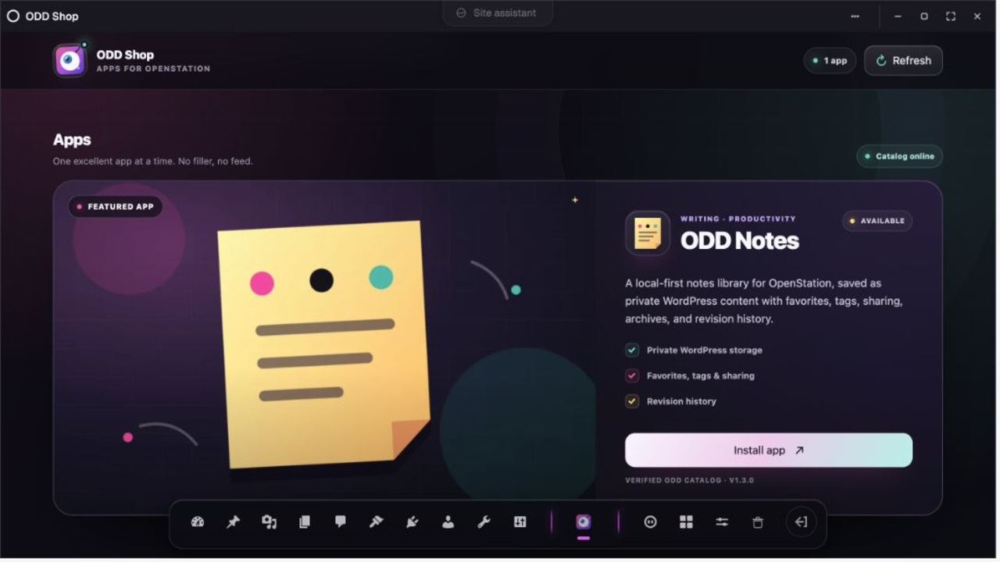
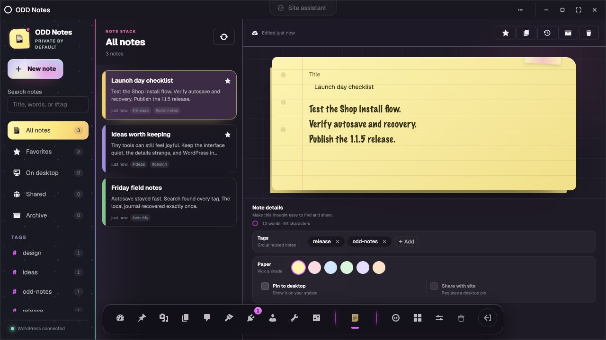

# ODD — Outlandish Desktop Decorator

**OpenStation turns WordPress into a desktop. ODD fills it with things worth opening.**

[OpenStation](https://github.com/WordPress/openstation) makes WordPress feel less like a stack of admin screens and more like a computer you own. You get a desktop, a dock, movable windows, and apps that can live alongside the work you are already doing.

ODD is an app shop made for that world. We are building useful little tools, playful experiments, and all sorts of cool apps that make OpenStation more personal, more capable, and more fun. Some will be practical. Some will be weird. A few may be delightfully unnecessary.

**ODD Notes is the first app, not the last.**

- [Try ODD in WordPress Playground](https://odd.regionallyfamous.com/go/)
- [Get ODD from WordPress.org](https://wordpress.org/plugins/odd-outlandish-desktop-decorator/)



## Why OpenStation is cool

OpenStation gives WordPress a place to breathe. Instead of bouncing between disconnected pages, you can open tools in real windows, arrange the things you use, and build a workspace that feels like yours.

- Open WordPress tools and apps in movable windows.
- Keep the things you use close on the desktop and dock.
- Move between tasks without losing your place.
- Keep WordPress as the home for your content and data.

It is still WordPress underneath. It just feels a lot more alive.

## Why ODD is cool

ODD gives OpenStation apps a friendly home. Open the Shop, see what looks interesting, install it, and launch it like it belongs there.

We are starting with one app because we want every app on the shelf to be worth opening. The collection will grow with useful apps, odd little ideas, creative tools, and things that make your OpenStation feel unlike anyone else's.

## Meet ODD Notes

ODD Notes is a calm place to catch a thought without leaving your desktop. Notes are saved in WordPress, private by default, and easy to find again.

- Write and autosave notes without breaking your flow.
- Organize with search, tags, favorites, and archives.
- Pin an important note right on the OpenStation desktop.
- Share a note only when you choose to.
- Recover local drafts and revisit earlier revisions.



## Try it

The fastest way to see ODD is the [live WordPress Playground demo](https://odd.regionallyfamous.com/go/). It opens a temporary WordPress site with OpenStation and the current stable ODD release ready to explore.

To install it on your own site, get [ODD from WordPress.org](https://wordpress.org/plugins/odd-outlandish-desktop-decorator/). ODD requires WordPress 6.8 or newer, PHP 8.1 or newer, and OpenStation 1.1.0 or newer.

## Want to help make the next app?

This repository contains the ODD Shop, ODD Notes, and the catalog that delivers apps to OpenStation. If you want to build, test, or contribute, start with the [contributor guide](CONTRIBUTING.md) or browse the [project wiki](https://github.com/RegionallyFamous/odd/wiki).

```sh
npm ci
npm run build:notes
npm test
```

The [development Playground](https://odd.regionallyfamous.com/go/dev/) follows the current `main` branch when you want to see what is coming next.

## License

GPLv2 or later. See [LICENSE](LICENSE).
